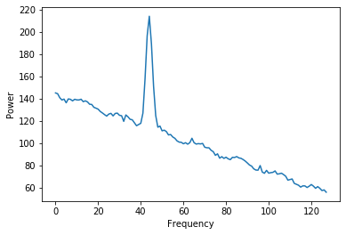

# NRAO_Interview
[](https://codecov.io/gh/cvalenzu/NRAO_Interview)  [](https://travis-ci.com/cvalenzu/NRAO_Interview)

Camilo Valenzuela's NRAO Interview exercise.

A simple script that takes a Spectrogram in CSV, generate plots and estimate the SNR.

## Installation

To install the required packages run:
```
pip install -r requirements.txt
```

Then installing the script is simple

```
pip install .
```

## Using the script

The script is called `nrao_script` it is installed on the python path and can be run in a terminal.

For more information run
```
nrao_script --help
```

## Running test & coverage

The `nrao_script` has a associated package called `nrao_interview`, this package has a `test` module.

To run tests:
```
pip install pytest
pip install coverage
coverage run -m pytest
```

This will generate a `.coverage` file and can be analyzed with
```
coverage report -m
```
showing the test code coverage.

## Signal to Noise Ratio (SNR) estimation

First we need to get the signal, we assume that the mean value over time for each frequency is the signal, so we calculate it for each frequency :


So the Power of the signal is 

Then we calculate the deviation from the mean


The deviation we will have an estimate of the noise for each time. Then we calculate the mean of the deviation and we'll get the  .


We calculate the SNR for each frequency


And get the max SNR as the estimate.


### Example:

The data and signal:



Then we estimate the noise get the mean at each frequency:

 

And later the SNR for each frequency:


And a SNR = 27.349


## Plots Generated.

This scripts create two plots:

1.- Basic information plot:


This plot has the Raw Data with frequency on the x axis, the mean of the Spectrogram (by assumption is the signal), with its min/max, and the SNR estimate for each frequency and the max value (the one selected and shown in the terminal).

2.- Over Time plot:


This plot can be used to check if there is a raise in the power over time, we can see the mean min and max. In this case there is no power spikes in the Spectrogram.

## Other notes

- The code is written for python 3, it will not work on python 2 (Just for some string formatting, is easy to made it compatible).

- In the SNR estimation function if the noise (deviation from the mean) is zero, then it will show a warning an get a `nan` result.

- There is no optimization for big files (if the file has too many Columns or rows the plots will be horrible).

- The first column is taken as the time for the spectrogram.
